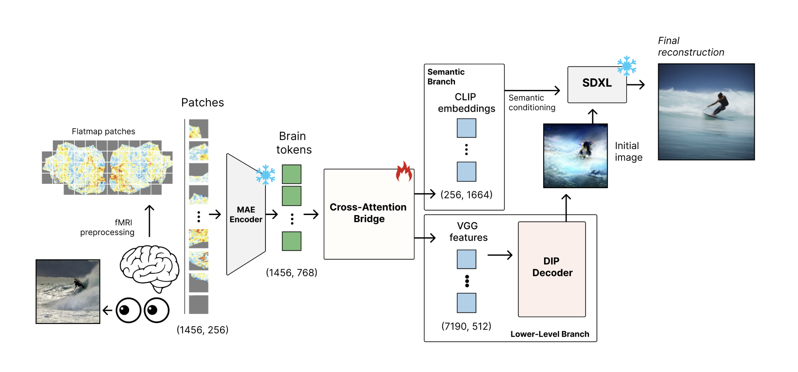
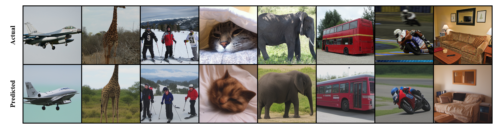

# CortexDecoder: fMRI-to-Image Reconstruction from Cortical Flatmaps

**CortexDecoder** reconstructs natural images from fMRI brain activity using a dual-branch cross-attention bridge and a frozen SDXL diffusion model. Cortical flatmap patches are tokenized via a pretrained CortexMAE encoder, then decoded into both low-level (VGG) and high-level (CLIP) visual features, which together guide image generation.

## Paper

[Project Paper (PDF)](https://drive.google.com/file/d/1enbKYnWTBWejX23fXj-fNeg9yO681rSn/view?usp=sharing)

## Architecture



## Method

- fMRI responses from the visual cortex are preprocessed into cortical flatmap patches (1456 × 256) and encoded into brain tokens (1456 × 768) by a frozen CortexMAE encoder.
- A **Cross-Attention Bridge** with learned query vectors maps brain tokens into two branches:
  - **Semantic Branch**: predicts CLIP ViT-bigG/14 image-patch embeddings (256 × 1664), used as semantic conditioning for SDXL.
  - **Lower-Level Branch**: predicts multi-layer VGG features (7190 × 512), inverted into an initial image via Deep Image Prior (DIP).
- The DIP-generated initial image and predicted CLIP embeddings are combined to condition a frozen **SDXL** diffusion model, producing the final reconstruction.

## Results



## Dataset

Trained and evaluated on the [Natural Scenes Dataset (NSD)](https://naturalscenesdataset.org/) for Subject 1:

| Split | Unique Images | Trials |
|-------|--------------|--------|
| Train | 8,528 | ~26,200 |
| Validation | 448 | ~2,460 |
| Test (shared-1000) | 1,000 | held out |

## Installation

```bash
pip install -r requirements.txt
```

## Notebooks

| Notebook | Description |
|----------|-------------|
| `production-vgg-train-sub1.ipynb` | Train VGG branch, predict VGG features, run DIP inversion |
| `production-clip-train-sub1.ipynb` | Train CLIP branch, predict CLIP embeddings |
| `production-final-diffusion-sub1.ipynb` | SDXL diffusion reconstruction and final evaluation |

## Requirements

See [requirements.txt](requirements.txt) for the full dependency list. Key dependencies:

- PyTorch + torchvision
- xformers
- diffusers + transformers
- open_clip_torch
- h5py, scipy, scikit-image
